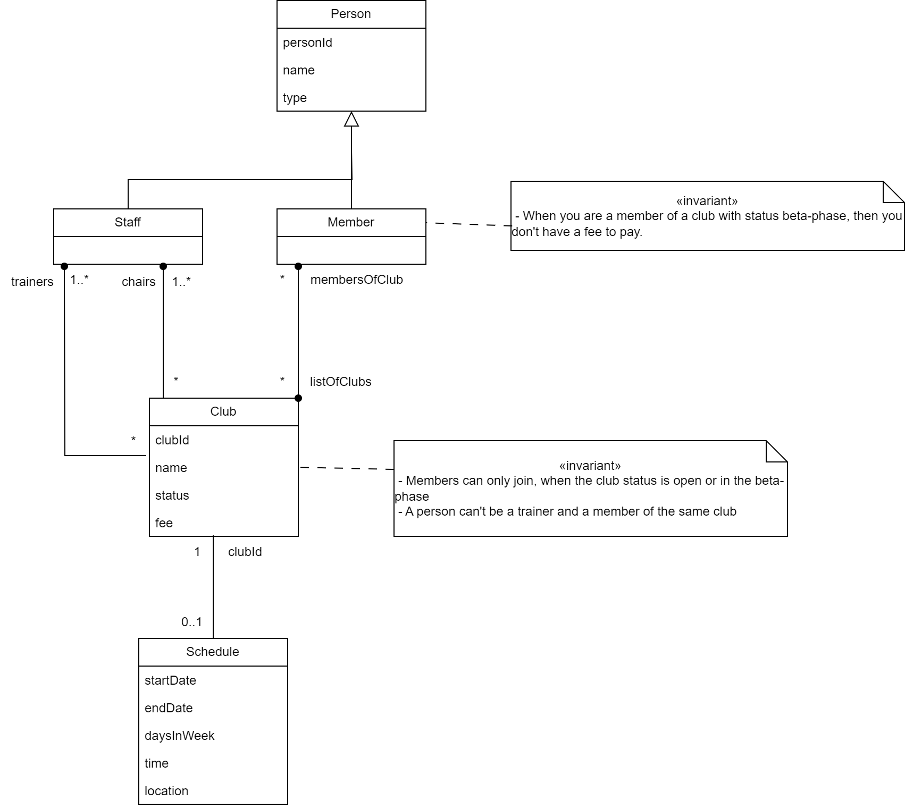
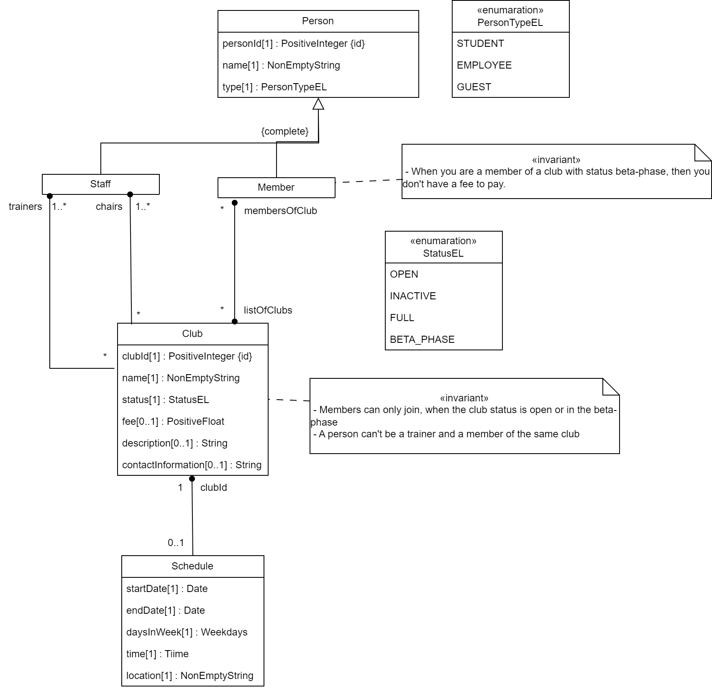

# Assignment7
## Clients

<H5>Group 3<H5>
<ul>
<li> Nour elhouda Benaida</li>
<li> George Elias</li>
</ul>

## Table of Contents

- [Description and activities](#description-and-activities)
- [Activities](#activities)
- [Purpose and Titles](#purpose-and-titles)
- [List of Information management tasks](#list-of-information-management-tasks)

The BTU Wellness Club 
# Description and activities

## Description

The BTU Wellness Club is a dynamic and inclusive community that offers a wide range of sports activities, fostering both physical fitness and personal growth. Located in the heart of University, the club boasts state-of-the-art facilities that cater to athletes of all ages and skill levels. As you step into our club, you'll be greeted by a buzzing atmosphere filled with the sounds of camaraderie and the sight of athletes pushing their limits.

Many courses such as Tennis, Football, Volleyball... are offered to our students, employees and guests at a minimal fee. These courses are as a means of entertainment and relaxation since studies and work could be a stressful task. Each Course is held many time during the week, therefore a participant has the freedom to choose the timing that suits him/her the most according to his/her timetable.

The clubs are coed and are suited for all skill levels, we are looking forward to have everyone accomadated but due to the various constraints, we can only accomadate few on the first come first serve bases.

## Activities
<ul>
  <li>Practicing Sports such as Tennis, Football, Volleyball</li>
  <li>Offering courses for relaxation such as Yoga, Pilates...</li>
  <li>Even Dancing courses such as Bachata and West Coast Swing are offered</li>
</ul> 

# Purpose and Titles

## Purpose
To encourage our students and employees for an overall wellbeing we provide a platform for them to enjoy their free time by joining sport courses, which provides a means of relaxation, relief, skill building, team building and the most important having fun and meeting new people. In addition, our club members can develop skills that can help them train and participate in professional tournaments in the future but the most important purpose of the club is to enhance the enjoyment of sports to the members.

## Title
BTU-WellnessClub

## Domain Name
BTU-WellnessClub

# List of Information management tasks
<ul>
	<li> Adding new member to the club</li>
	
Title: create new Member.

    	
Description: we create a new record for each new member that joins one of the sports in the club,  we add the ID, Name, the type{student, employee, guest}, the role {trainer, player}, and the list of clubs that a member is associated with, fee-total (auto-calculated).

Constraints: The fee is calculated based on the following condition. 
Student, Employee and Guest have different fee associated to the club they enroll in.
If the member is a trainer there is no fee for that particular club he/she is associated to.
Fee should not be added for an inactive club the person is associated too.

     
<li>Show the List of the members</li>
	
Title: list of members.

     	
Description: Here we can show the list of all the members with their data, ID, Name, Type, Role, Clubs and total-fee.

      
<li>Update the data of a member</li>
	
Title: Update member.

	
Description: Making modification of the data of an existing member.

      
<li>Delete the data of a member of the club</li>
	
Title: Delete a Member.

	
Description: Deleting the data of the member who leaves the club or clubs.

<li>Adding a new club</li>
	
Title: create new Club.

	
Description: we create a new record for each new club.
     We add the ID, Name, Description, fees {student fee, faculty fee, guest fee), trainer, chairs, Status {active or inactive}, contact information.

     
<li>Show the details of the club and its associated players and members</li>
	
Title: list the club information and the participant list.

     	
Description: Here we can show the details of the club and a list of enrolled participating players and members of club for the current term. 
  
      
<li>Update the data of a club</li>
	
Title: Update club details.

	
Description: Making modification of the data of existing details.

      
<li>Delete the data of the club</li>
	
Title: Delete the club.

	
Description: Deleting the data of the club for once and for all.

	
<li>Creating Schedule</li>
	
Title: create new schedule.

    	
Description: we create a new schedule for each club. 
     We add the ID (auto populated), Time period (Mar-Aug 2023), term {summer, fall, winter, spring}, week {list of week}, time and location.

     
<li>Show the details list of club and its schedule</li>
	
Title: list the club and its associated schedule for a given time-period.

     	
Description: Here we can show the details of the club and the entire associated schedule.

      
<li>Update the data in the schedule</li>
	
Title: Update the schedule details.

	
Description: Making modification of the data of an existing schedule.

    
<li>Delete the schedule</li>
	
Title: Delete the schedule.

	
Description: Deleting the schedule of the club for once and for all.

</ul>

# Requirements document 

<table>
  <tr>
    <th>Original version</th>
    <th>Elaborated/improved version</th>
 </tr>
 <tr>
    <td>Table Member</td>
    <td>rename table member into person</td>
 </tr>
 <tr>
    <td>Table Member</td>
    <td>add a new table named: member to make the difference between participants and administration staff</td>
 </tr>
 <tr>
    <td>Table Staff</td>
    <td>add a new table named: stuff to make the difference between participants and administration staff</td>
 </tr>
 <tr>
    <td>A person has a role « trainer/ player »</td>
    <td>The property role is deleted, the distinction between admins, trainers, and participants will be in the table club</td>
 </tr>	
 <tr>	
    <td>Create a new record for each new member that joins one of the sports in the club</td>
    <td>A person can be added as a club member only when he is enroled in a least one club</td>
 </tr>
 <tr>
    <td>Table Person, type {student, employee, guest}</td>
    <td>A trainer can be of any person type student, an employee or a guest</td>
 </tr>
  <tr>
    <td>Table Club, trainer</td>
    <td>One club can have one or many trainers</td>
  </tr>	
 <tr>
    <td>Table Club, trainer</td>
    <td>A club trainer can be a member in another club</td>
  </tr>
  <tr>
    <td>Table Club, status: active</td>
    <td>rename status into « open »</td>
  </tr>
  <tr>
    <td>Table Club, status has only 2 options « open/ inactive »</td>
    <td>Add two new states:  full and beta-phase</td>
  </tr>
  <tr>
  <tr>
    <td>Table Club, status has one new option: full</td>
    <td>Option full:  the registration is closed and all participants will be billed</td>
  </tr>
  <tr>
    <td>Table Club, status has one new option: beta-registered</td>
    <td>Option beta-phase: club members need not pay (be billed) it's free</td>
  </tr>
  <tr>
    <td>Table Club, status</td>
    <td>Members can only join the club, when it is open or beta-registered</td>
  </tr>
  <tr>
    <td>Table Club, status</td>
    <td>Members can´t join a club that is inactive or full</td>
  </tr>
  <tr>
    <td>Table Club, chairs</td>
    <td>The chairs could be of person type: student, employees, or guest</td>
  </tr>
  <tr>
    <td>Table Club, status: complete</td>
    <td>The fee is added to the member profile only when the associated club status is complete</td>
  </tr>	
  <tr>
    <td>Students, employees and guests have different fees associated to the club they enrolled in</td>
    <td>Students have a fee depending on the club fees. Everyone else (guests and employees) will pay the student fee plus a fix amount</td>
  </tr>
  <tr>
    <td>If member is a trainer there is no fee for that particular club he/she is associated to</td>
    <td>There is no fees for trainers </td>
  </tr>
  <tr>
    <td>Create a new schedule for each club</td>
    <td>The club is mandatory to add a new schedule</td>
  </tr>
  <tr>
    <td>Create a new schedule for each club</td>
    <td>A shedule of a club X can be created only when the club exists</td>
  </tr>
  <tr>
    <td>Table Club, Table Member</td>
    <td>added a memberOfClub property</td>
  </tr>
</table>

# Domain Model

# Design Model

# Developers

<H6>Group 2<H6>
<ul>
<li>Dustin Troppa</li>
<li>Rania Ouaja</li>
</ul>
<H7>Work division:<H7>
<ul>
<li> Requirements document: Rania Ouaja</li>
<li> Domain information model: Dustin Troppa</li>
<li> Domain information model corrected: Rania Ouaja</li>
<li> Design information model: Dustin Troppa</li>
</ul>
